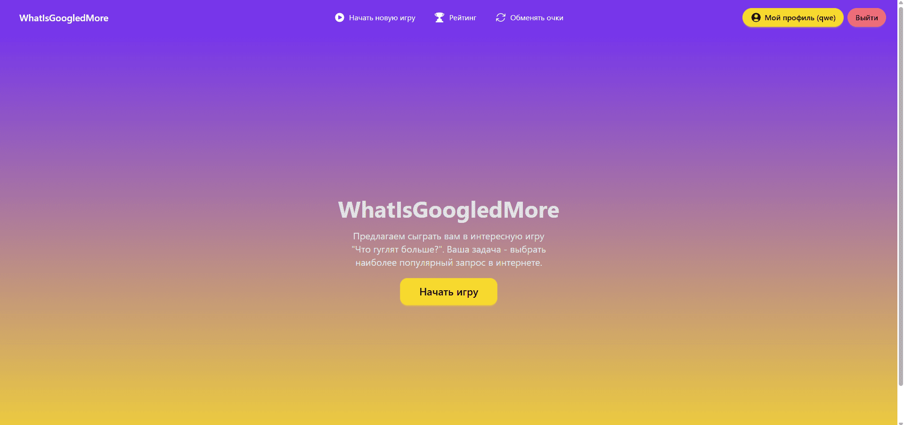
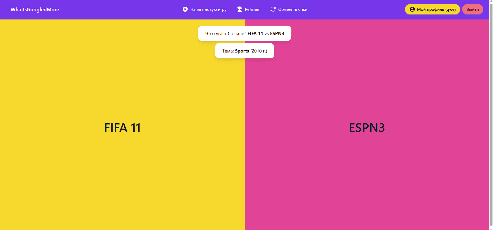
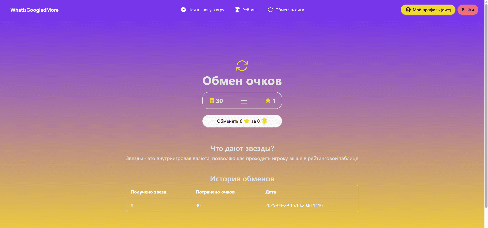
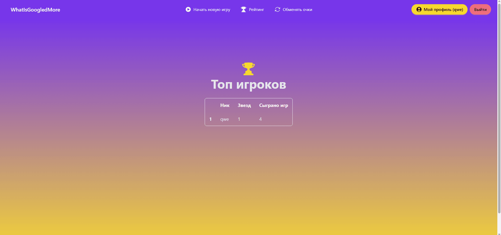
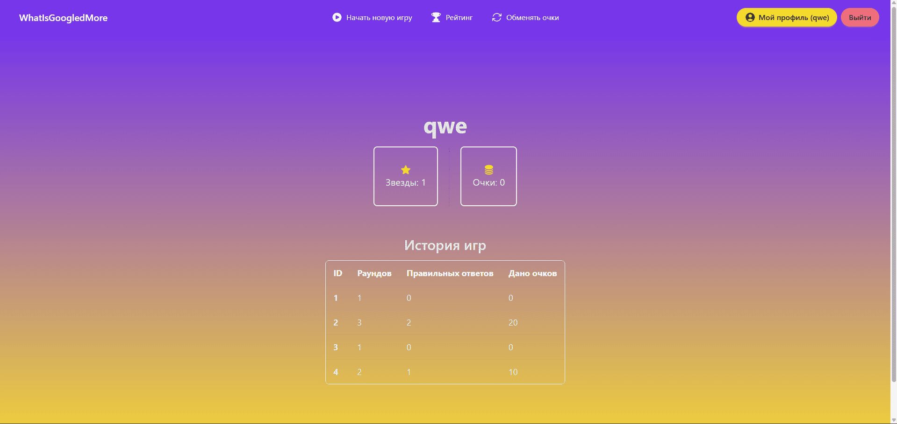

# Сайт "WhatIsGoogledMore"

> [!IMPORTANT]
> 💛 Итоговый проект по разделу WEB (Flask) в Яндекс Лицей

---

## 📜 Описание
WhatIsGoogledMore – это интерактивная веб-игра "Что гуглят больше?". Игроку предлагается угадать, какой из двух предложенных запросов в Google ищут чаще.

Игра сочетает в себе элементы викторины, аналитики и соревнования, позволяя игрокам проверить свою интуицию и знание популярных трендов.

## 📝 Техническое задание

### Взаимодействие с аккаунтом
- [x] Начальная страница
- [x] Форма входа и регистрации
- [x] Возможность выйти из аккаунта
- [x] Страница с обменом очков на звезды
- [x] Страница профиля с просмотром истории игр
- [x] Страница с топом игроков
- [x] Подсчет места в топе за количество звезд

### Игра "Что гуглят больше?"
После нажатия на кнопку "играть" происходит редирект на страницу
с первым вопросом из рубрики "Что гуглят больше?"
- Страница с игрой:
  - [x] Изменение вопросов до 1 неверного выбора
  - [x] Подсчет очков за каждый правильный ответ
  - [x] Выдача очков по завершении игры

### Датасет Google Trends
- [ ] Очистить и адаптировать датасет под формат викторины

- Таблица **users**

|          | id                     | username        | stars         | points        | points_spent                       | hashed_password   | created_date       |
|----------|------------------------|-----------------|---------------|---------------|------------------------------------|-------------------|--------------------|
| Описание | ID игрока              | Никнейм         | Баланс звезд  | Баланс очков  | Общее количество потраченных очков | Хэш пароля        | Дата регистрации   |
| Свойства | PK, INT, AUTOINCREMENT | VARCHAR, UNIQUE | INT, NOT NULL | INT, NOT NULL | INT, NOT NULL                      | VARCHAR, NOT NULL | DATETIME, NOT NULL |

- Таблица **games**

|          | id                     | total_rounds       | trends           | points_gave               | created_date       | user_id       |
|----------|------------------------|--------------------|------------------|---------------------------|--------------------|---------------|
| Описание | ID игры                | Количество раундов | Вопросы (тренды) | Количество выданных очков | Дата создания игры | ID игрока     |
| Свойства | PK, INT, AUTOINCREMENT | INT, NOT NULL      | BLOB, NOT NULL   | INT, NOT NULL             | DATETIME, NOT NULL | INT, NOT NULL |
*Подсчет ошибочных ответов необходим в случае, если игрок покинет страницу игры, но не даст ответ*

## 📃 Пояснительная записка

### Проект: название и автор
**Название сайта:** WhatIsGoogledMore 
**Автор:** Кирушев Кирилл

### Описание идеи
**WhatIsGoogledMore** — это интерактивная веб-игра "Что гуглят больше?". Игроку предлагается угадать, какой из двух предложенных запросов в Google ищут чаще.

Игра сочетает в себе элементы викторины, аналитики и соревнования, позволяя игрокам проверить свою интуицию и знание популярных трендов.
Игрок может соревноваться за место в топе при помощи внутриигровой валюты - звезд. Звезды можно обменять за очки, которые даются за правильные ответы
на вопросы.

### Описание реализации
В проекте используется **Flask** — это легкий фреймворк для создания веб-приложений. Данные хранятся в **SQLite**, а для удобной работы с базой применяется **ORM SQLAlchemy**. Это позволяет легко управлять данными без написания сложных SQL-запросов.

Приложение работает через **собственное API**, которое отвечает за:

- Загрузку вопросов (основанных на трендах из Google).
- Подсчет очков и результатов игры.
- Обмен игровых очков на звезды (бонусная система).

Страницы сайта общаются с API через **JavaScript** — это делает игру динамичной, без постоянных перезагрузок.

Данные для вопросов берутся из готовых ***датасетов Google Trends** (популярные поисковые запросы за разные годы и страны).

**Перспективы:**
- Онлайн игра с другом (ответы на вопросы в рамках одной сессии)
- Выбор типов вопросов за определенный год/диапазон годов
- Увеличение количества параметров для соревновательной системы

### Технологии
| Модуль                | Описание                                                                                      |
|-----------------------|-----------------------------------------------------------------------------------------------|
| flask                 | основная библиотека для создания сайта                                                        |
| flask-wtf             | дополнение к основной библиотеке для создания форм                                            |
| flask-sqlalchemy      | дополнение к основной библиотеке для взаимодействия с базой данных SQLAlchemy                 |
| flask-login           | дополнение к основной библиотеке для реализации регистрации/авторизации пользователя на сайте |
| sqlalchemy            | ORM для базы данных SQLite3                                                                   |
| python-dotenv         | библиотека для загрузки виртуального окружения                                                |
| sqlalchemy-serializer | библиотека для сериализации данных с базы данных                                              |
| flask-restful         | библиотека для создания своего API                                                            |

### Скрины

---

## Презентация проекта
Ссылка на [папку с презентацией](https://example.com)